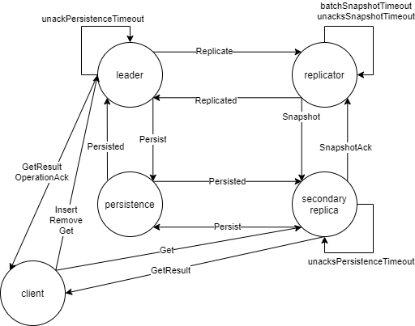

### Architecture questions
Q: Should messages be distinguished by arguments, message name or sender?
A: The way the protocol is designed both Insert & Replicate are essentially
   the same message, except different names and different ids. Not clear
   on the implications of this. Associated questions include should you
   accept messages from anyone or do you have to maintain a list of 
   nodes etc? Feels like the blockchain question actually.
Q: What is the point of having a middle-man replicator?
A: Basically seems to be for batching and timeouts - which you might want
   for all operations and therefore need a middle-man for all operations?
   Also it is used for the seq generation to handle repeated messages etc.
Q: Why is there a separate id and from seq?
A: I think this is about separating the replicator requests and the primary
   requests
Q: It says in the notes that the logic for collecting acknowledgements
   of persistence and replication can be used by both the primary and 
   secondary replicas? How doe that work given one uses seq and the other id?
A: ~
Q: How do we handle unacknowledge requests 

### Replicator questions
Q: How should we handle seq number? Should it be immutable or mutable var?
A: Adv of mutable is it's easy to handle as local state, and not clear if 
   immutable if you can keep just 'become'-ing new state to handle changes
   in variables. Surely this doesn't lead to a stack-overflow etc?
Q: Can Replicate requests fail?
A: Assume not so don't need to re-send
Q: How to we handle unack requests when a replica/replicator is removed?
A: We could process and pretend SnapshotAcks were sent or do we pretend
   Replicated were sent? Or go straight to OperationAck? If we have a 
   map from long to set of actor refs then how do we match the ActorRef?
   Have to go through and manually pattern match which is complexity-wise
   inefficient. Maybe we can do something with postHook

### Blocking/Timeout Questions
Q: How avoid blocking when waiting for responses?
A: With manual wait times or through Akka API? If former you can send a 
   message to yourself with a time delay to avoid blocking. It turns out
   Akka ask pattern allows a future and timeout
Q: How get timeout to work?
A: Either send a message to oneself after the timeout using something like
   context.system.scheduler.scheduleOnce(10.seconds, self, Timeout). Or 
   can use timeout with ask pattern e.g. val future = myActor.ask("hello")
   (5 seconds) explicitly or implicitly with implicit val timeout = 
   Timeout(5 seconds). This can be combined with pipe(f) to actorD which 
   installs an onComplete handler on the future. For the former can 
   also use a context.setReceiveTimeout(30 milliseconds) 
Q: We don't want the ask to fail immediately but to retry a few times
   How do we manage those failures and retries within the ask pattern?
A: Maybe it is a separate thing? https://www.lightbend.com/blog/how-akka-works-at-least-once-message-delivery. We decided not to use it
   because it requires use of PersistenceActor which in turn requires 
   receiveRecover system and corresponding leveldb which then doesn't 
   work with the tests which would require SharedLeveldbStore.class
   in actor creation 
   https://doc.akka.io/docs/akka/2.3/java/persistence.html#Shared_LevelDB_journal
   This is all clearly more advanced then we have learnt so far
Q: How pattern match on multiple timeouts?
A: Can't just use Timeout so instead pattern match on timeout values 
   with backticks to differentiate value matching not type matching.
Q: How handle unacks?
A: At first I thought we could just have a queue of unacknowledged 
   requests but actually that doesn't work because when get an ack
   we need a key to know which unack to remove. Furthermore, because
   we are sending the same request to multiple secondary replicators
   /replicas we need to manage a set of them
Q: How do we know 1s has passed and we need to send an 
   OperationFailed message?
A: Track them in a map. Unclear how we are meant to break together
   all the machinery
Q: Should persistence and replication checks be the same integrated check
   or two separate checks?
A: Two different, because they have different times

### API Questions
Q: Should the read-only replicas ignore Insert & Remove requests or 
   respond with OperationFailed?
A: Just ignore.
Q: Should acks be a list of unacknowledged message or all messages over the
   lifecycle?
A: All messages because needed if want to replicate all operations to a 
   new replica
Q: How remove items from a vector?
A: There doesn't seem to be a remove method so I guess just loop through and
   re-assign
Q: How do we avoid this nested get/set stuff with scala where I'm 
   pattern matching 2 or 3 levels deep
A: ~